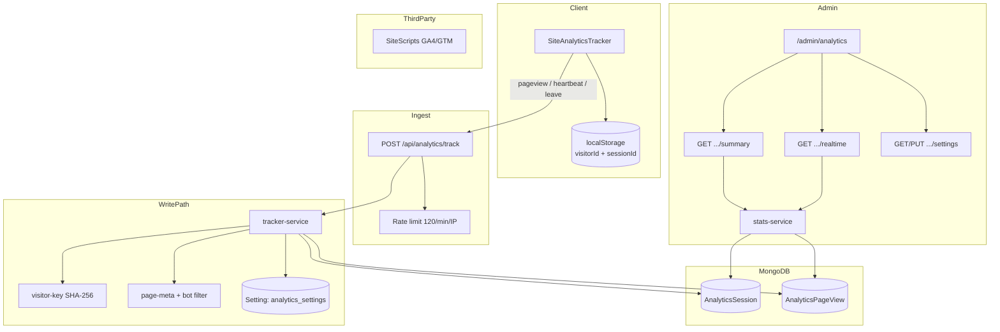
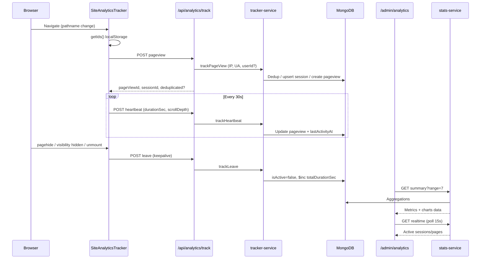
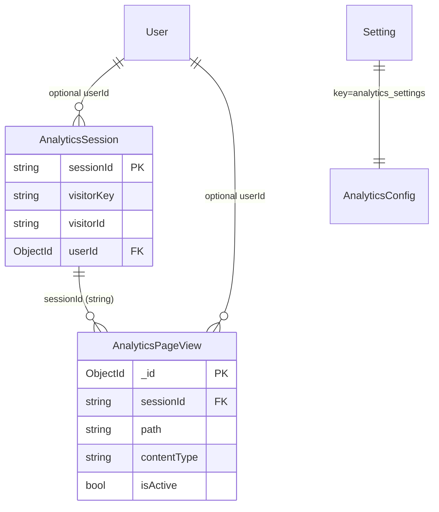
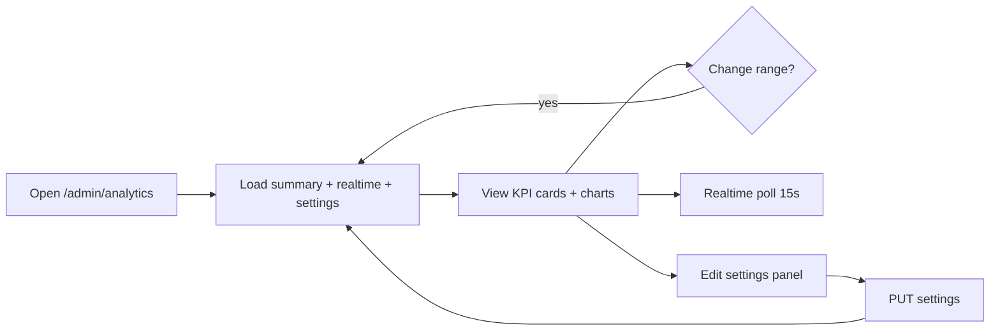
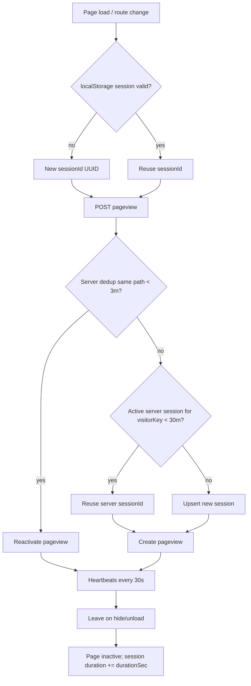

# Analytics System Architecture

Technical architecture of the first-party visitor / behavior analytics stack in this Next.js shop. Use this document to reimplement a similar enterprise analytics system in another product.

**Stack:** Next.js 15 (App Router) · React 19 · MongoDB/Mongoose · Zod · Recharts  
**Scope:** First-party tracking + admin dashboard. Optional third-party GA4/GTM is separate and documented in §1.3.

---

## Table of contents

1. [System overview](#1-system-overview)
2. [Backend](#2-backend)
3. [Database](#3-database)
4. [Frontend / admin dashboard](#4-frontend--admin-dashboard)
5. [Tracking engine](#5-tracking-engine)
6. [Metrics calculation](#6-metrics-calculation)
7. [Security and privacy](#7-security-and-privacy)
8. [APIs](#8-apis)
9. [Deployment requirements](#9-deployment-requirements)
10. [File map & reuse checklist](#10-file-map--reuse-checklist)
11. [Known gaps & caveats](#11-known-gaps--caveats)

---

## 1. System overview

### 1.1 Purpose

First-party analytics answers:

- How many page views and unique visitors occurred in a date range?
- Who is online now, and on which pages?
- How long do people stay, and which pages/products/blogs are popular?
- What devices, browsers, and OSes are used?

Design goals visible in code:

- Own the data (MongoDB), not only third-party dashboards.
- Avoid counting refresh / close-reopen spam (3-minute pageview dedup).
- Avoid storing raw IPs (hash only).
- Dual identity: client `visitorId` (localStorage) + server `visitorKey` (IP + UA fingerprint).

### 1.2 Main components

| Layer | Component | Path |
|-------|-----------|------|
| Client tracker | `SiteAnalyticsTracker` | `components/analytics/SiteAnalyticsTracker.tsx` |
| Mount point | Shop chrome (non-admin, non-auth) | `components/layout/ShopChrome.tsx` |
| Ingest API | `POST /api/analytics/track` | `app/api/analytics/track/route.ts` |
| Write service | Tracker service | `lib/analytics/tracker-service.ts` |
| Identity | Visitor key / IP helpers | `lib/analytics/visitor-key.ts` |
| UA parsing | Device/browser/OS parser | `lib/analytics/user-agent-parser.ts` |
| Path metadata | Content type + bot filter | `lib/analytics/page-meta.ts` |
| Models | Session + pageview | `models/Analytics.ts` |
| Settings | DB-backed config | `lib/admin/analytics-settings*.ts` |
| Read service | Aggregations | `lib/analytics/stats-service.ts` |
| Admin APIs | Summary / realtime / settings | `app/api/admin/analytics/*` |
| Admin UI | Dashboard | `app/admin/analytics/page.tsx` |
| Charts | Shared chart kit | `components/admin/charts/AdminChartKit.tsx` |

### 1.3 Dual analytics channels

1. **First-party** (this document) — owned Mongo collections + `/admin/analytics`.
2. **Third-party** — optional GA4 / GTM via SEO settings (`site_seo`), loaded by `components/seo/SiteScripts.tsx`. If GTM ID is set, standalone GA4 gtag is skipped.



### 1.4 Data flow: user action → dashboard



---

## 2. Backend

### 2.1 Related files, modules, services, APIs

#### Core write path

| File | Role |
|------|------|
| `app/api/analytics/track/route.ts` | Public ingest; Zod union; rate limit; attach optional `userId` |
| `lib/analytics/tracker-service.ts` | `trackPageView`, `trackHeartbeat`, `trackLeave`, `endSession` |
| `lib/analytics/visitor-key.ts` | `buildVisitorKey`, `hashIp`, `extractClientIp`, idle/dedup constants |
| `lib/analytics/page-meta.ts` | Bot UA regex, `resolvePageMeta`, `shouldTrackPath` |
| `lib/analytics/user-agent-parser.ts` | `parseUserAgent` → device/browser/OS/vendor/model/label |
| `models/Analytics.ts` | Mongoose schemas + indexes |

#### Core read path

| File | Role |
|------|------|
| `lib/analytics/stats-service.ts` | `getAnalyticsSummary`, `getRealtimeAnalytics` |
| `app/api/admin/analytics/summary/route.ts` | Admin summary |
| `app/api/admin/analytics/realtime/route.ts` | Admin realtime |
| `app/api/admin/analytics/settings/route.ts` | GET/PUT analytics (+ captcha co-located) |

#### Settings

| File | Role |
|------|------|
| `lib/admin/analytics-settings-config.ts` | Types, defaults, normalize |
| `lib/admin/analytics-settings.ts` | Load/save via `Setting` key `analytics_settings` |
| `models/SupportModels.ts` | Generic `Setting` key/value store |

#### Cross-cutting

| File | Role |
|------|------|
| `lib/security/rate-limit.ts` | In-memory sliding window |
| `lib/api/guards.ts` | `requireAdmin()` |
| `lib/auth/session.ts` | Session cookie → optional `userId` on track |
| `lib/admin/dashboard-dates.ts` | `tehranDateKey` for daily trend fill |
| `lib/db/mongoose.ts` | DB connection |

### 2.2 Tracking / event collection logic

Event types accepted by ingest API:

| `type` | Client sends? | Server handler |
|--------|---------------|----------------|
| `pageview` | Yes (on route change) | `trackPageView` |
| `heartbeat` | Yes (every 30s) | `trackHeartbeat` |
| `leave` | Yes (hide/unload/cleanup) | `trackLeave` |
| `end` | **No** (API only) | `endSession` |

**`trackPageView` gates** (any fail → silent no-op / `null`):

1. `settings.enabled`
2. Path not in `excludePaths` prefixes
3. `/admin*` only if `trackAdmin`
4. Authenticated users skipped if `!trackAuthenticated && userId`
5. Bot UA rejected (`isBotUserAgent`)

Then: fingerprint → dedup → session reuse → upsert session → create pageview (or reactivate deduped view).

### 2.3 Session management

**Client session** (`SiteAnalyticsTracker`):

- Key: `site_session_data` → `{ id, expires }`
- Idle window: **30 minutes** (`SESSION_IDLE_MS`)
- Sliding: each pageview start and each heartbeat calls `touchSession` (extends `expires`)
- New UUID if missing or expired

**Server session** (`AnalyticsSession`):

- Primary key: `sessionId` (unique)
- Reuse rule in `findOrReuseSession`: same `visitorKey`, `isBot: false`, `lastActivityAt >= now - 30m`, no `endedAt` → return that `sessionId` instead of client’s new one
- Upsert updates `lastActivityAt`, clears `endedAt`, `$inc pageViews` on real (non-dedup) pageviews
- `endSession` sets `endedAt` and deactivates active pageviews — **implemented but never called by the client**

### 2.4 Visitor identification algorithm

Two IDs are stored on every session and pageview:

| ID | Source | Persistence |
|----|--------|-------------|
| `visitorId` | Client UUID in `localStorage` (`site_visitor_id`) | Survives reloads; lost if storage cleared |
| `visitorKey` | Server: `SHA256(ip + "|" + ua[:500]).hex[:32]` | Stable across storage clears if IP+UA unchanged |

```text
buildVisitorKey(ip, ua) =
  SHA256( `${ip.trim()}|${ua.trim().slice(0,500)}` ).digest('hex').slice(0, 32)

hashIp(ip) =
  SHA256( ip.trim() ).digest('hex').slice(0, 16)
```

IP extraction order: `x-forwarded-for` (first hop) → `x-real-ip` → `"unknown"`.

**Implication for uniqueness:** NAT / shared office IPs with same browser UA can merge visitors. Clearing localStorage without changing IP/UA keeps the same `visitorKey`.

### 2.5 Unique visitor calculation

Preferred identity expression:

```js
{ $ifNull: ['$visitorKey', '$visitorId'] }
```

Range unique visitors:

```js
AnalyticsPageView.aggregate([
  { $match: { createdAt: { $gte: since } } },
  { $group: { _id: { $ifNull: ['$visitorKey', '$visitorId'] } } },
  { $count: 'count' }
])
```

Daily/weekly/monthly trends use `$addToSet` of the same expression, then `$size`.

### 2.6 Online users detection

**Active window:** last **5 minutes**.

| Query | Criteria |
|-------|----------|
| `activeNow` / session list | `lastActivityAt >= now-5m`, `isBot: false`, `endedAt` does not exist |
| Active pages | `isActive: true`, `updatedAt >= now-5m` |

Realtime API returns up to 20 sessions and 20 pages; dashboard shows `activeCount` and active page list; polls every **15s**.

Hourly “active users” chart (last 24h): sessions with `lastActivityAt` in last 24h, grouped by Tehran hour, unique visitors per bucket.

### 2.7 Duration / time spent

**Client:**

```text
durationSec = round((Date.now() - enteredAt) / 1000)
scrollDepth = min(100, round(((scrollTop + viewport) / docHeight) * 100))
```

**Server:**

- Heartbeat: set pageview `durationSec` / `scrollDepth`, touch session `lastActivityAt`
- Leave: same fields + `isActive: false`, `leftAt: now`, and  
  `$inc: { totalDurationSec: durationSec }` on the session (**full page duration, not delta**)

**Average duration (dashboard):** mean of pageviews with `durationSec > 0` in range, then `Math.round`.

Scroll depth is stored but **not** aggregated in summary metrics.

### 2.8 Aggregation jobs / cron

**None for analytics.**

- No rollup collections
- No retention cleanup job (despite `retentionDays` setting)
- Existing crons (`expire-payments`, backups) are unrelated

All dashboard metrics are computed **on read** via Mongo aggregations.

### 2.9 Database models and indexes

See [§3 Database](#3-database).

### 2.10 Data retention strategy

| Setting | Default | Enforcement |
|---------|---------|-------------|
| `retentionDays` | 90 (clamped 7–365) | **Not enforced** — UI/settings only |

To implement retention in a port: scheduled delete on `AnalyticsPageView` / `AnalyticsSession` where `createdAt < now - retentionDays`.

---

## 3. Database

### 3.1 Collections

Mongoose model names → typical Mongo collection names:

| Model | Collection (default) | Purpose |
|-------|----------------------|---------|
| `AnalyticsSession` | `analyticssessions` | Visit sessions |
| `AnalyticsPageView` | `analyticspageviews` | Individual page views |
| `Setting` | `settings` | Key `analytics_settings` (+ SEO for GA/GTM) |

### 3.2 AnalyticsSession fields

| Field | Type | Description |
|-------|------|-------------|
| `sessionId` | String, unique | Client/server session UUID |
| `visitorId` | String | Client localStorage UUID |
| `visitorKey` | String | Server IP+UA fingerprint |
| `ipHash` | String | Hashed IP (16 hex chars) |
| `userId` | ObjectId → User | Optional logged-in user |
| `landingPath` | String | First path (`$setOnInsert`) |
| `referrer` | String | Document referrer |
| `userAgent` | String | Truncated to 500 on write |
| `device` | enum | `mobile` \| `tablet` \| `desktop` \| `unknown` |
| `browser`, `browserVersion` | String | Parsed UA |
| `os`, `osVersion` | String | Parsed UA |
| `deviceVendor`, `deviceModel`, `deviceLabel` | String | Vendor/model + Persian label |
| `screenWidth`, `screenHeight` | Number | From client |
| `pageViews` | Number | Incremented on non-dedup pageviews |
| `totalDurationSec` | Number | Sum of leave durations |
| `isBot` | Boolean | Always false on accepted tracks |
| `lastActivityAt` | Date | Heartbeat / leave / pageview |
| `endedAt` | Date? | Set by `endSession` |
| `createdAt`, `updatedAt` | Date | Mongoose timestamps |

### 3.3 AnalyticsPageView fields

| Field | Type | Description |
|-------|------|-------------|
| `sessionId`, `visitorId`, `visitorKey`, `ipHash`, `userId` | same as session | Denormalized for query speed |
| `path` | String | URL pathname |
| `title` | String | `document.title` |
| `contentType` | enum | `page` \| `product` \| `blog` \| `category` \| `checkout` \| `dashboard` \| `other` |
| `contentSlug` | String | Extracted from path |
| `referrer` | String | |
| device/browser/os/screen fields | | Copied from UA + screen |
| `durationSec` | Number | Engagement time on page |
| `scrollDepth` | Number | 0–100 |
| `isActive` | Boolean | True until leave/end |
| `leftAt` | Date? | Leave timestamp |
| timestamps | | |

### 3.4 Relationships



There is **no** Mongoose `ref` from pageview → session; join is by string `sessionId`.

### 3.5 Indexes

**AnalyticsSession**

- Unique: `sessionId`
- Single: `visitorId`, `visitorKey`, `ipHash`, `userId`, `isBot`, `lastActivityAt`
- Compound: `{ createdAt: -1 }`, `{ visitorKey: 1, lastActivityAt: -1 }`

**AnalyticsPageView**

- Single: `sessionId`, `visitorId`, `visitorKey`, `ipHash`, `userId`, `path`, `contentType`, `contentSlug`, `isActive`
- Compound: `{ createdAt: -1 }`, `{ path: 1, createdAt: -1 }`, `{ visitorKey: 1, path: 1, createdAt: -1 }`

The compound `{ visitorKey, path, createdAt }` supports the 3-minute dedup query.

### 3.6 Sample documents

**Session**

```json
{
  "_id": "66f000000000000000000001",
  "sessionId": "a1b2c3d4-e5f6-7890-abcd-ef1234567890",
  "visitorId": "v_11111111-2222-3333-4444-555555555555",
  "visitorKey": "9f86d081884c7d659a2feaa0c55ad015",
  "ipHash": "a665a4592042",
  "userId": null,
  "landingPath": "/products/gold-ring",
  "referrer": "https://google.com/",
  "userAgent": "Mozilla/5.0 ... Chrome/120.0.0.0 ...",
  "device": "desktop",
  "browser": "Chrome",
  "browserVersion": "120.0.0.0",
  "os": "Windows",
  "osVersion": "10/11",
  "deviceVendor": "Microsoft",
  "deviceModel": "PC",
  "deviceLabel": "Chrome 120 · Windows 10/11 · دسکتاپ",
  "screenWidth": 1920,
  "screenHeight": 1080,
  "pageViews": 3,
  "totalDurationSec": 145,
  "isBot": false,
  "lastActivityAt": "2026-09-09T05:40:00.000Z",
  "createdAt": "2026-09-09T05:30:00.000Z",
  "updatedAt": "2026-09-09T05:40:00.000Z"
}
```

**Page view**

```json
{
  "_id": "66f0000000000000000000aa",
  "sessionId": "a1b2c3d4-e5f6-7890-abcd-ef1234567890",
  "visitorId": "v_11111111-2222-3333-4444-555555555555",
  "visitorKey": "9f86d081884c7d659a2feaa0c55ad015",
  "ipHash": "a665a4592042",
  "path": "/products/gold-ring",
  "title": "انگشتر طلا | ناب سرا",
  "contentType": "product",
  "contentSlug": "gold-ring",
  "referrer": "https://google.com/",
  "device": "desktop",
  "browser": "Chrome",
  "browserVersion": "120.0.0.0",
  "os": "Windows",
  "osVersion": "10/11",
  "deviceLabel": "Chrome 120 · Windows 10/11 · دسکتاپ",
  "screenWidth": 1920,
  "screenHeight": 1080,
  "durationSec": 72,
  "scrollDepth": 64,
  "isActive": false,
  "leftAt": "2026-09-09T05:31:12.000Z",
  "createdAt": "2026-09-09T05:30:00.000Z",
  "updatedAt": "2026-09-09T05:31:12.000Z"
}
```

**Settings (`analytics_settings`)**

```json
{
  "key": "analytics_settings",
  "value": {
    "enabled": true,
    "trackAdmin": false,
    "trackAuthenticated": true,
    "heartbeatSeconds": 30,
    "retentionDays": 90,
    "excludePaths": ["/api", "/_next", "/favicon.ico"]
  }
}
```

### 3.7 Query patterns

| Use case | Pattern |
|----------|---------|
| Dedup pageview | `findOne({ $or: [{visitorKey},{visitorId}], path, createdAt: {$gte: now-3m} }).sort(createdAt:-1)` |
| Reuse session | `findOne({ visitorKey, isBot:false, lastActivityAt:{$gte:idle}, endedAt:{$exists:false} })` |
| Range counts | `countDocuments({ createdAt: {$gte: since} })` |
| Unique visitors | `$group` by `$ifNull[visitorKey,visitorId]` |
| Top paths/products | `$match` range (+ contentType) → `$group` by path/slug → `$sort` views → `$limit` |
| Online | Sessions: activity in 5m; Pages: `isActive` + `updatedAt` in 5m |
| Trends | `$dateToString` with `timezone: 'Asia/Tehran'` |

### 3.8 Performance considerations

- Indexes cover the hottest filters (`createdAt`, `visitorKey+path+createdAt`, `visitorKey+lastActivityAt`).
- Summary runs **many parallel aggregations** on every dashboard load — fine for moderate traffic; for enterprise scale add rollup collections or materialize daily stats.
- Device/browser/OS breakdowns count **pageviews**, not unique visitors (can overweight heavy browsers).
- In-memory rate limiter is **per process** — not shared across multi-instance deploys.
- `enrichContentTitles` does extra `Product` / `BlogPost` lookups by slug for top lists.

---

## 4. Frontend / admin dashboard

### 4.1 Pages and components

| Path | Role |
|------|------|
| `app/admin/analytics/page.tsx` | Full analytics dashboard (RTL Persian UI) |
| `components/admin/charts/AdminChartKit.tsx` | Area / bar / donut charts, duration formatter |
| `components/admin/AdminUI.tsx` | `AdminStatCard`, `AdminLoading`, `AdminPageBanner` |
| `components/admin/AdminLayoutShell.tsx` | Nav link: `/admin/analytics` («آمار بازدید») |
| `components/analytics/SiteAnalyticsTracker.tsx` | Storefront tracker (returns `null`) |
| `components/layout/ShopChrome.tsx` | Mounts tracker when not `/admin` or `/auth` |
| `components/seo/SiteScripts.tsx` | Optional GA4/GTM |

### 4.2 Charts and metrics (UI)

**Stat cards**

- Page views (`totalPageViews`)
- Unique visitors (`uniqueVisitors`)
- Online now (`realtime.activeCount` fallback `activeNow`)
- Average duration (`avgDurationSec`)
- Sessions (`uniqueSessions`)
- Dominant device (first of `deviceBreakdown`)

**Charts / lists**

- Trend area chart: daily / weekly / monthly tabs (views + unique visitors)
- Hourly active users (24h bar chart)
- Live active pages list
- Browser & OS donuts
- Device detail table (label, type, screen, views)
- Top pages / products / blogs (views + avg duration)

### 4.3 API consumption

```text
On load / range change:
  GET /api/admin/analytics/summary?range={7|14|30|90}
  GET /api/admin/analytics/realtime
  GET /api/admin/analytics/settings

Every 15s:
  GET /api/admin/analytics/realtime

Settings save:
  PUT /api/admin/analytics/settings  { analytics, captcha }
```

Uses `adminFetch` from `lib/admin/client.ts` (cookie session).

### 4.4 Filters and date ranges

| Control | Values | Effect |
|---------|--------|--------|
| Range chips | 7, 14, 30, 90 days | Reloads summary (`rangeStart` = start of day, `rangeDays - 1` days back) |
| Trend tabs | daily / weekly / monthly | Switches chart series (weekly = last 12 weeks; monthly = last 6 months — **not** limited to selected range) |

Timezone for buckets: **Asia/Tehran**.

### 4.5 User interaction flow



Admin banner copy states visits are based on IP + browser without duplicate close/reopen counting — matches server dedup.

---

## 5. Tracking engine

### 5.1 How page views are recorded

1. `ShopChrome` mounts `SiteAnalyticsTracker` on shop pages.
2. On `pathname` change (skip `/admin*`):
   - Ensure `visitorId` / `sessionId` in localStorage
   - `POST` `{ type:'pageview', sessionId, visitorId, path, title, referrer, screenWidth, screenHeight }`
3. Server validates, applies gates, builds `visitorKey` / `ipHash`, parses UA, resolves `contentType`/`contentSlug` from path.
4. Dedup or create; return `{ pageViewId, sessionId, deduplicated }`.
5. Client stores `pageViewId` and may adopt server `sessionId` (session reuse).

**Content type resolution** (`resolvePageMeta`):

| Path pattern | contentType | contentSlug |
|--------------|-------------|-------------|
| `/products/{slug}` | `product` | slug |
| `/blog/{slug}` (not `/blog`) | `blog` | slug |
| `/categories/{slug}` | `category` | slug |
| `/checkout*` | `checkout` | `''` |
| `/dashboard*` | `dashboard` | `''` |
| `/`, `/products`, `/blog`, `/contact` | `page` | path |
| else | `other` or `page` | path |

### 5.2 How duplicate visits are prevented

**PAGEVIEW_DEDUP_MS = 3 minutes.**

If a pageview exists for same `visitorKey` **or** `visitorId` + same `path` with `createdAt` in the last 3 minutes:

- Do **not** create a new pageview
- Do **not** increment session `pageViews`
- Reactivate existing pageview (`isActive: true`, clear `leftAt`)
- Touch session activity
- Return `deduplicated: true`

This handles refresh spam and rapid close/reopen of the same URL.

### 5.3 IP + browser/device fingerprinting

Not a canvas/WebGL fingerprint. Server-side only:

```text
visitorKey = SHA256(ip | userAgent[:500])[:32]
ipHash     = SHA256(ip)[:16]
```

Device/browser/OS are **parsed** from UA via regex heuristics (`user-agent-parser.ts`) and stored as structured fields + human-readable `deviceLabel` (Persian).

Screen size comes from the client (`window.screen` / `innerWidth`).

### 5.4 How sessions are created and closed

```mermaid
stateDiagram-v2
  [*] --> ClientSession: UUID + expires(+30m)
  ClientSession --> ServerUpsert: POST pageview
  ServerUpsert --> ReusedSession: active visitorKey within 30m
  ServerUpsert --> NewSession: otherwise upsert new sessionId
  ReusedSession --> Engaged: heartbeats
  NewSession --> Engaged
  Engaged --> Left: leave event
  Left --> IdleAging: no activity
  IdleAging --> NewSession: after 30m idle (new visit)
  note right of Left: endedAt rarely set\n(client never sends type:end)
```

**Closed practically by:** idle timeout (no activity ≥ 30m) and leave marking pageviews inactive. Explicit `endedAt` is optional API-only.

### 5.5 How active users are detected

See [§2.6](#26-online-users-detection). Heartbeats every 30s keep `lastActivityAt` / `updatedAt` fresh so “online” stays true while the tab is open.

### 5.6 Browser / device / OS collection

| Signal | Source |
|--------|--------|
| User-Agent string | Request header (stored ≤500 chars) |
| device / browser / os / versions / vendor / model / label | `parseUserAgent(ua)` |
| screenWidth / screenHeight | Client payload |
| Bot filter | UA regex: `bot\|crawl\|spider\|slurp\|headless\|lighthouse\|preview\|facebookexternalhit\|whatsapp` |

No third-party fingerprinting SDK.

---

## 6. Metrics calculation

### 6.1 Views (page views)

```text
totalPageViews = COUNT(AnalyticsPageView WHERE createdAt >= since)
```

Deduplicated revisits within 3 minutes do **not** add a new document, so they do not increase this count.

### 6.2 Unique visitors

```text
uniqueVisitors = COUNT DISTINCT COALESCE(visitorKey, visitorId)
                 over pageviews in range
```

### 6.3 Sessions

```text
uniqueSessions = COUNT(AnalyticsSession
                       WHERE createdAt >= since AND isBot = false)
```

Session length semantics: client + server idle window of 30 minutes.

### 6.4 Average duration

```text
avgDurationSec = ROUND(
  AVG(durationSec) WHERE createdAt >= since AND durationSec > 0
)
```

Page-level and content top-lists also compute `$avg: '$durationSec'` per group.

### 6.5 Bounce / exit behavior

**Not implemented.**

Collected fields that could support bounce later:

- Single pageview per session (`pageViews === 1`)
- Low `durationSec`
- `leftAt` / `isActive`

Exit/bounce rate is **not** in `stats-service` or the dashboard.

### 6.6 Active users

```text
activeNow = COUNT(sessions WHERE
  lastActivityAt >= now - 5min
  AND isBot = false
  AND endedAt does not exist)

hourlyActiveUsers[hour] = COUNT DISTINCT COALESCE(visitorKey, visitorId)
  for sessions with lastActivityAt in that Tehran hour (last 24h)
```

### 6.7 Popular pages

```text
GROUP pageviews by path
  views = SUM(1)
  avgDuration = AVG(durationSec)
SORT views DESC
LIMIT 8
```

Title = `$last` title on the group (cleaned of site name suffix when enriching products/blogs).

### 6.8 Popular products / content

```text
Products: contentType = 'product' AND contentSlug != ''
  GROUP BY contentSlug → top 8
Blogs:    contentType = 'blog' AND contentSlug != ''
  GROUP BY contentSlug → top 8
```

Titles enriched from `Product.name` / `BlogPost.title` by slug; fallback to cleaned tracked title or slug.

**Content type mix:** `$group` by `contentType` for donut fallback.

### 6.9 Constants (limits)

| Constant | Value | File |
|----------|-------|------|
| `SESSION_IDLE_MS` | 30 min | `visitor-key.ts` / client tracker |
| `PAGEVIEW_DEDUP_MS` | 3 min | `visitor-key.ts` |
| Active window | 5 min | `stats-service.ts` |
| Heartbeat interval | 30 s (client hardcoded) | `SiteAnalyticsTracker.tsx` |
| Realtime poll | 15 s | admin page |
| `TOP_PAGES_LIMIT` / products / blogs | 8 | `stats-service.ts` |
| `DEVICE_DETAIL_LIMIT` | 12 | `stats-service.ts` |
| Rate limit | 120 / 60s / IP | track route |

---

## 7. Security and privacy

### 7.1 Stored user identifiers

| Identifier | Stored? | Notes |
|------------|---------|-------|
| Raw IP | **No** | Only `ipHash` |
| `visitorKey` | Yes | One-way hash of IP+UA |
| `visitorId` | Yes | Opaque client UUID |
| `userId` | Optional | If logged in at track time |
| Full User-Agent | Yes (≤500) | Needed for parsing / debug |
| Screen size | Yes | Non-PII technical |

### 7.2 IP handling

- Extracted only to compute hashes for the request
- Prefer proxy headers (`x-forwarded-for`, `x-real-ip`) — ensure reverse proxy sets these correctly in production
- Hash is truncated SHA-256 (not reversible in practice, but saltless — consider salting for enterprise ports)

### 7.3 Authentication requirements

| Endpoint | Auth |
|----------|------|
| `POST /api/analytics/track` | **Public** (rate-limited) |
| Admin analytics APIs | `requireAdmin()` → logged-in user with role ≥ `ADMIN` |

### 7.4 Permissions

- Admin role gate via `hasMinimumRole(user.role, 'ADMIN')` (`lib/api/guards.ts` + `server/permissions`)
- Settings toggles:
  - `trackAdmin` — allow `/admin` paths (client still skips mounting on admin)
  - `trackAuthenticated` — include logged-in shop users
- No CSRF token on track; relies on same-origin browser `fetch` + rate limit
- Track errors return generic `{ ok: false }` without leaking internals

### 7.5 Abuse controls

- Zod validation (string lengths, numeric bounds)
- Bot UA rejection
- Path exclude list
- Rate limit: `checkRateLimit(\`analytics:${ip}\`, 120, 60_000)` → HTTP 429

---

## 8. APIs

### 8.1 `POST /api/analytics/track`

**Purpose:** Ingest tracking events.  
**Auth:** Public.  
**Rate limit:** 120 requests / 60 seconds / IP.

#### Request — pageview

```json
{
  "type": "pageview",
  "sessionId": "uuid-min-8-chars",
  "visitorId": "uuid-min-8-chars",
  "path": "/products/gold-ring",
  "title": "انگشتر طلا | ناب سرا",
  "referrer": "https://...",
  "screenWidth": 1920,
  "screenHeight": 1080
}
```

#### Response — pageview

```json
{
  "ok": true,
  "pageViewId": "66f0...",
  "sessionId": "uuid-possibly-reused",
  "deduplicated": false
}
```

If tracking disabled / gated: still `ok: true` with `pageViewId: null`.

#### Request — heartbeat / leave

```json
{
  "type": "heartbeat",
  "sessionId": "...",
  "pageViewId": "...",
  "durationSec": 45,
  "scrollDepth": 60
}
```

(`leave` same shape with `"type": "leave"`.)

#### Response

```json
{ "ok": true }
```

#### Request — end (server-supported, unused by client)

```json
{ "type": "end", "sessionId": "..." }
```

#### Error responses

| Status | Body | When |
|--------|------|------|
| 429 | `{ ok: false }` | Rate limited |
| 400 | `{ ok: false }` | Zod / parse failure |

---

### 8.2 `GET /api/admin/analytics/summary`

**Purpose:** Aggregated dashboard metrics.  
**Auth:** Admin.  
**Query:** `range` = `7` \| `14` \| `30` \| `90` (default 7).

#### Response (shape)

```json
{
  "summary": {
    "rangeDays": 7,
    "totalPageViews": 1200,
    "uniqueVisitors": 340,
    "uniqueSessions": 410,
    "activeNow": 5,
    "avgDurationSec": 48,
    "trend": [{ "date": "2026-09-09", "views": 10, "visitors": 4 }],
    "weeklyTrend": [{ "week": "2026-W36", "label": "هفته 36", "views": 80, "visitors": 20 }],
    "monthlyTrend": [{ "month": "2026-09", "label": "2026-09", "views": 300, "visitors": 90 }],
    "hourlyTrend": [{ "hour": "2026-09-09 14:00", "label": "۱۴:۰۰", "activeUsers": 3, "sessions": 4 }],
    "topPages": [{ "path": "/", "title": "...", "views": 50, "avgDurationSec": 20 }],
    "topProducts": [{ "slug": "...", "title": "...", "views": 12, "avgDurationSec": 40 }],
    "topBlogs": [{ "slug": "...", "title": "...", "views": 8, "avgDurationSec": 90 }],
    "deviceBreakdown": [{ "device": "mobile", "count": 700 }],
    "browserBreakdown": [{ "name": "Chrome 120", "count": 500 }],
    "osBreakdown": [{ "name": "Android 14", "count": 400 }],
    "deviceDetailBreakdown": [{
      "label": "...",
      "deviceType": "mobile",
      "browser": "Chrome",
      "os": "Android",
      "vendor": "Samsung",
      "model": "...",
      "screen": "390×844",
      "count": 40
    }],
    "contentTypeBreakdown": [{ "type": "product", "count": 200 }]
  }
}
```

---

### 8.3 `GET /api/admin/analytics/realtime`

**Purpose:** Online sessions and active pages.  
**Auth:** Admin.

#### Response

```json
{
  "realtime": {
    "activeSessions": [
      {
        "sessionId": "...",
        "device": "mobile",
        "deviceLabel": "...",
        "browser": "Chrome",
        "os": "Android",
        "deviceModel": "...",
        "pageViews": 2,
        "totalDurationSec": 90,
        "lastActivityAt": "..."
      }
    ],
    "activePages": [
      {
        "path": "/products/x",
        "title": "...",
        "contentType": "product",
        "device": "Chrome 120 · Android 14 · ...",
        "durationSec": 30
      }
    ],
    "activeCount": 3
  }
}
```

---

### 8.4 `GET /api/admin/analytics/settings`

**Purpose:** Load analytics + captcha settings (co-located).  
**Auth:** Admin.

#### Response

```json
{
  "analytics": {
    "enabled": true,
    "trackAdmin": false,
    "trackAuthenticated": true,
    "heartbeatSeconds": 30,
    "retentionDays": 90,
    "excludePaths": ["/api", "/_next", "/favicon.ico"]
  },
  "captcha": { "...": "..." }
}
```

---

### 8.5 `PUT /api/admin/analytics/settings`

**Purpose:** Persist analytics and/or captcha settings.  
**Auth:** Admin.

#### Request

```json
{
  "analytics": {
    "enabled": true,
    "trackAdmin": false,
    "trackAuthenticated": true,
    "heartbeatSeconds": 30,
    "retentionDays": 90,
    "excludePaths": ["/api", "/_next", "/favicon.ico"]
  },
  "captcha": { }
}
```

#### Response

```json
{
  "ok": true,
  "analytics": { "...normalized..." },
  "captcha": { "...normalized..." }
}
```

---

## 9. Deployment requirements

### 9.1 Required services

| Service | Role |
|---------|------|
| Node.js runtime (Next.js / custom `server.js`) | App + APIs |
| MongoDB | Store sessions, pageviews, settings |
| Reverse proxy (recommended) | Set `X-Forwarded-For` / `X-Real-IP` |

No Redis, message queue, or analytics worker is required for the current design.

### 9.2 Environment variables

**No analytics-specific env vars.**

Indirect dependencies:

| Variable | Why |
|----------|-----|
| `MONGODB_URI` | Persistence |
| `AUTH_SECRET` | Admin sessions + optional `userId` on track |
| `NEXT_PUBLIC_SITE_URL` | Site URL / SEO (not ingest) |
| `CRON_SECRET` | Unrelated payment cron only |

GA/GTM IDs live in DB setting `site_seo`, not env.

### 9.3 Background workers

| Worker | Analytics-related? |
|--------|--------------------|
| Analytics aggregation | **None** |
| Retention cleanup | **None** (setting unused) |
| `node-cron` backups | Unrelated |
| `/api/cron/expire-payments` | Unrelated |

### 9.4 Dependencies (npm)

Relevant packages from `package.json`:

- `mongoose` — models
- `zod` — ingest validation
- `recharts` — admin charts
- `server-only` — protect server modules
- `next` / `react` — framework
- `react-icons` — admin icons

No dedicated analytics SDK (PostHog, Plausible, Mixpanel, etc.).

### 9.5 Runtime notes for multi-instance

- Rate limiter is process-local `Map` — use Redis/shared store if horizontally scaled.
- Session reuse and dedup rely on Mongo consistency — OK with a single Mongo primary.

---

## 10. File map & reuse checklist

### 10.1 Complete first-party file list

```text
models/Analytics.ts
models/index.ts                          # re-exports Analytics*
models/SupportModels.ts                  # Setting store

lib/analytics/visitor-key.ts
lib/analytics/tracker-service.ts
lib/analytics/stats-service.ts
lib/analytics/page-meta.ts
lib/analytics/user-agent-parser.ts

lib/admin/analytics-settings-config.ts
lib/admin/analytics-settings.ts
lib/admin/dashboard-dates.ts             # Tehran date keys
lib/admin/client.ts                      # adminFetch
lib/security/rate-limit.ts
lib/api/guards.ts
lib/auth/session.ts
lib/db/mongoose.ts

app/api/analytics/track/route.ts
app/api/admin/analytics/summary/route.ts
app/api/admin/analytics/realtime/route.ts
app/api/admin/analytics/settings/route.ts

components/analytics/SiteAnalyticsTracker.tsx
components/layout/ShopChrome.tsx
components/admin/charts/AdminChartKit.tsx
app/admin/analytics/page.tsx
components/admin/AdminLayoutShell.tsx    # nav entry

# Optional third-party
components/seo/SiteScripts.tsx
lib/admin/site-settings-config.ts
```

### 10.2 Porting checklist (enterprise reuse)

1. Copy models + indexes; decide collection naming and TTL indexes for retention.
2. Port `visitor-key` (add **salt** for `ipHash` / `visitorKey` if required by privacy policy).
3. Port tracker service gates and dedup/session reuse constants as configurable.
4. Mount a client tracker on public layouts; send pageview / heartbeat / leave.
5. Secure admin read APIs with your RBAC.
6. Either keep on-read aggregations or add nightly rollups for high volume.
7. Enforce `retentionDays` with a scheduled job.
8. Wire `heartbeatSeconds` from settings to the client (currently hardcoded 30s).
9. Optionally implement bounce rate: sessions with `pageViews === 1` and short duration.
10. Call `end` on `beforeunload` if you need explicit session close semantics.
11. Replace in-memory rate limit with a shared store for multi-node.
12. Keep GA/GTM as an optional parallel channel if marketing needs it.

---

## 11. Known gaps & caveats

| Topic | Reality in this codebase |
|-------|--------------------------|
| Bounce / exit rate | Not calculated |
| Retention cleanup | Setting only; no job |
| `heartbeatSeconds` setting | Stored; client ignores (hardcoded 30s) |
| `type: 'end'` | API exists; client never sends |
| Session `totalDurationSec` | `$inc` of **full** leave duration — repeated leave can inflate if `leavingRef` fails |
| Scroll depth | Stored, not shown in summary |
| Device breakdowns | Based on pageviews, not unique visitors |
| Weekly/monthly charts | Fixed lookbacks (12 weeks / 6 months), independent of range chip |
| CSRF on track | None |
| Analytics cron | None |
| Shipping “tracking” / Tailwind `tracking-*` | Unrelated false positives |

---

## Appendix A — Session lifecycle (client + server)



---

## Appendix B — Code reference index

| Concern | Primary reference |
|---------|-------------------|
| Schemas / indexes | `models/Analytics.ts` |
| Fingerprint + constants | `lib/analytics/visitor-key.ts` |
| Write path | `lib/analytics/tracker-service.ts` |
| Aggregations / formulas | `lib/analytics/stats-service.ts` |
| Client tracker | `components/analytics/SiteAnalyticsTracker.tsx` |
| Ingest API | `app/api/analytics/track/route.ts` |
| Admin UI | `app/admin/analytics/page.tsx` |
| Settings defaults | `lib/admin/analytics-settings-config.ts` |
| UA parsing | `lib/analytics/user-agent-parser.ts` |
| Path → content meta | `lib/analytics/page-meta.ts` |

---

*Generated from source inspection only. No application code was modified for this document beyond creating this file.*
